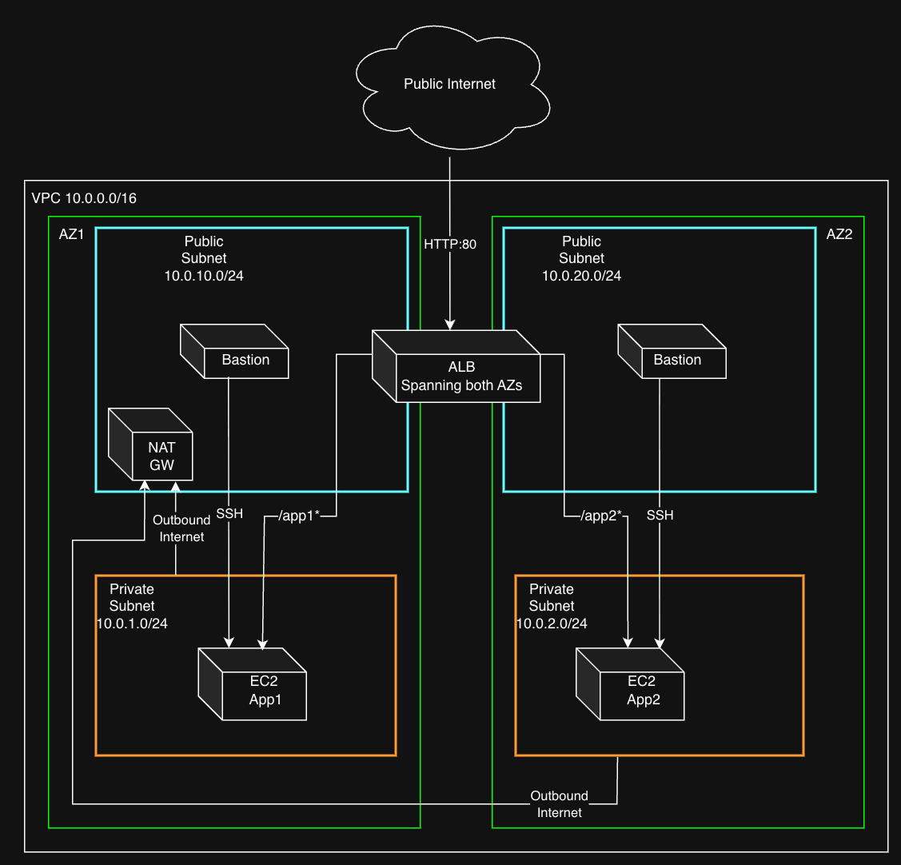

# AWS Multi-Tier Network Architecture with Terraform

A production-grade AWS network infrastructure built entirely with Terraform, demonstrating multi-tier architecture with path-based routing, private compute, and least-privilege security groups.

---

## Architecture Overview



---

## Resources Created

- **VPC** — `10.0.0.0/16` with 2 public and 2 private subnets across 2 Availability Zones
- **Internet Gateway** — for public subnet internet access
- **NAT Gateway** — for private subnet outbound internet access
- **Bastion Hosts** — 2 EC2 instances in public subnets (one per AZ) for SSH access
- **Application EC2s** — 2 private EC2 instances running Apache HTTP server
- **Application Load Balancer** — internet-facing, HTTP:80, spanning both AZs with path-based routing
- **Target Groups** — 2 target groups with health checks for app1 and app2
- **Security Groups** — least-privilege rules (local Terraform module)
- **Remote State** — stored in S3 with native state locking

---

## Security Design

Security groups follow least-privilege principle:

| Security Group | Applied To | Allows |
|---|---|---|
| `allow_SSH_to_bastion` | Bastion EC2 | SSH from internet (0.0.0.0/0) |
| `allow_SSH_from_bastion` | App EC2s | SSH from VPC CIDR only |
| `allow_http_to_ALB` | ALB | HTTP from internet (0.0.0.0/0) |
| `allow_http_from_ALB` | App EC2s | HTTP from ALB SG only (not VPC CIDR) |

**Key design decisions:**
- App EC2s allow HTTP only from the ALB security group — not from the entire VPC CIDR. This ensures only the ALB can reach the application instances.
- SSH access to private instances uses **SSH agent forwarding** — the private key never leaves the engineer's laptop and is never stored on the bastion host.
- Cross-zone load balancing enabled on both target groups to ensure even traffic distribution across AZs.
- Egress rules explicitly defined using `aws_vpc_security_group_egress_rule` — when using this resource AWS removes the default allow-all outbound rule, so all egress must be explicitly defined.

---

## Module Structure

```
aws-multi-tier-network-terraform/
  images/
    architecture.png
  modules/
    security-groups/       # Local module — written from scratch
      main.tf
      variables.tf
      outputs.tf
  alb.tf                   # ALB registry module
  ec2.tf                   # EC2 registry module + AMI data source
  SG.tf                    # Calls local security-groups module
  VPC.tf                   # VPC registry module
  outputs.tf
  variables.tf
  version.tf               # Provider + backend config
  terraform.tfvars.example
  app1-install.sh          # Apache setup with IMDSv2
  app2-install.sh
```

**Registry modules used:**
- `terraform-aws-modules/vpc/aws` v6.6.0
- `terraform-aws-modules/ec2-instance/aws` v6.3.0
- `terraform-aws-modules/alb/aws` v10.5.0

**Local modules written:**
- `./modules/security-groups` — all security groups and rules

---

## Prerequisites

- Terraform >= 1.12
- AWS CLI configured with appropriate profile
- AWS key pair created in your target region
- S3 bucket for remote state storage

---

## How to Deploy

**1. Clone the repository:**
```bash
git clone https://github.com/satyam-tripathi-7/aws-multi-tier-network-terraform.git
cd aws-multi-tier-network-terraform
```

**2. Create your tfvars file:**
```bash
cp terraform.tfvars.example terraform.tfvars
```

Edit `terraform.tfvars` with your values:
```hcl
region        = "ap-south-1"
aws_profile   = "your-aws-profile"
instance_type = "t3.micro"
key_name      = "your-key-pair-name"
```

**3. Update the backend config in `version.tf`:**
```hcl
backend "s3" {
  bucket = "your-terraform-state-bucket"
  key    = "AWS_Network_Project/terraform.tfstate"
  region = "your-region"
}
```

**4. Initialize and deploy:**
```bash
terraform init
terraform plan
terraform apply
```

**5. Access the application:**

After apply completes, Terraform outputs the ALB DNS name:
```
alb_dns = "my-alb-xxxxxxxxx.ap-south-1.elb.amazonaws.com"
```

- Root URL → Fixed response: `Welcome to my project`
- `/app1` → Routes to App1 instance
- `/app2` → Routes to App2 instance

**6. SSH access via bastion:**
```bash
# Add key to SSH agent
ssh-add your-key.pem

# Connect to bastion with agent forwarding
ssh -A ec2-user@<bastion-public-ip>

# From bastion, hop to private instance
ssh ec2-user@<private-instance-ip>
```

Note: Both bastion hosts can reach all private instances. SSH agent forwarding is used — the private key never leaves your local machine.

**7. Destroy when done:**
```bash
terraform destroy
```

---

## Known Behaviour

- After `terraform apply`, app instances take 2-4 minutes to become healthy as the user data script installs and starts Apache. Health check requires 3 consecutive successful checks (90 seconds minimum) before traffic is routed.
- User data script uses IMDSv2 (Instance Metadata Service v2) for instance metadata retrieval. IMDSv2 is the more secure method recommended by AWS over IMDSv1 as it requires a session-oriented token, protecting against SSRF attacks.
- In a production environment, consider pre-baking an AMI with Apache pre-installed to eliminate the startup delay.

---

## Limitations & Production Considerations

- **HTTP only** — This project uses HTTP for simplicity. In production:
  - Register a domain in Route53
  - Issue an SSL certificate via AWS Certificate Manager (ACM) — free
  - Add HTTPS listener on port 443 with SSL termination at the ALB
  - Redirect HTTP → HTTPS automatically
  - This is a straightforward addition once a domain is available

- **Single NAT Gateway** — One NAT Gateway is deployed in AZ1 for cost efficiency. This means private instances in AZ2 route outbound traffic through AZ1, creating a cross-AZ dependency. If AZ1 fails, AZ2 private instances lose outbound internet access. In production, deploy one NAT Gateway per AZ:
  ```hcl
  one_nat_gateway_per_az = true
  ```

- **Backend configuration** — S3 backend values are hardcoded in `version.tf`. This is a known Terraform limitation — variables cannot be used inside the `backend` block as it is initialized before variables are loaded. In production, use partial backend configuration with `-backend-config` flags or a separate `backend.hcl` file (added to `.gitignore`) to avoid hardcoding environment-specific values:
  ```bash
  terraform init -backend-config="bucket=your-bucket" -backend-config="region=your-region"
  ```

- **Single instance per app** — No Auto Scaling Group. In production, an ASG would ensure availability and handle traffic spikes automatically.

- **Pre-baked AMI** — User data script installs Apache at boot time causing 2-4 minute startup delay. In production, use EC2 Image Builder to create a custom AMI with Apache pre-installed for faster instance startup.

---

## Technologies Used

- Terraform v1.12+
- AWS Provider v6.x
- Amazon Linux 2023
- Apache HTTP Server
- AWS ALB, EC2, VPC, S3
